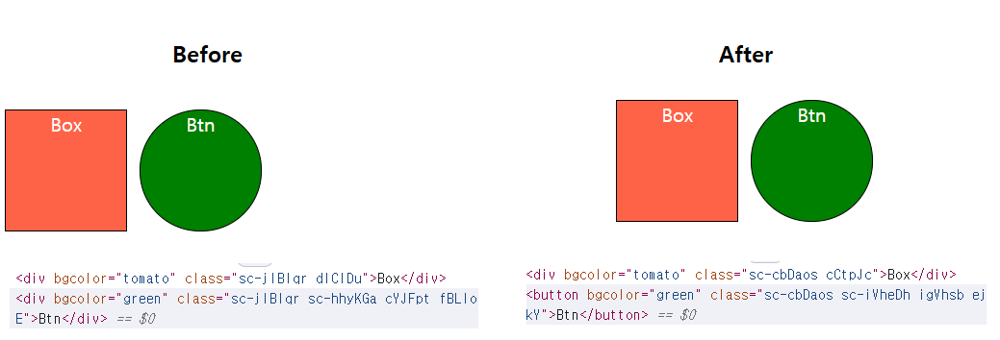

- 지금까지 `styled-components` 생성하는 방법부터 `styled()` 함수를 활용해서 <br/>
	`CSS Style`  상속 받는 법까지 배웠다.
- 이번에 다루는 것은 `HTML Element` 다른 `HTML Element`로 교체하는 방법에 대한 것이다.

---
#### `as`

``` jsx
import styled from "styled-components";

const Parents = styled.div`
	display: flex;
`

const Box = styled.div`
	background-color: ${(props) => props.bgColor};
	border: 1px solid black;
	width: 100px; height: 100px;
	color: white;
	text-align: center;
	margin: 5px;
`;

const Btn = styled(Box)`
	border-radius: 50px;
`;

function App(){
	return (
		<Parents>
			<Box bgColor="red">Box 1</Box>
			<Btn as="button">Push Button</Btn>
		</Parents>
	);
}
```

- `Btn` Component를 만들고, `Box`의 `Style` 상속 받은 상태이다.
- 여기서 `Btn` Component는 `div` 태그인데, 이걸 `button`이나 `a`와 같이 <br/>
	다른 종류의 `HTML Element`로 교체하고 싶다면 `'as'` props 추가하고 <br/>
	교체하고 싶은 `HTML Element`를 값으로 전달해보자.

- 개발자 Console에서 확인해보면, `Btn` Component가 <br/>
	`<div>`에서 `<button>` Element로 변경된 것을 볼 수 있다.



---

#### `attrs`

``` jsx
const Exam = styled.input.attrs(/*attributes*/)``;
```

- 위의 예시처럼 HTML 태그 이름 뒤에 `.attrs()` 추가하면 <br/>
- `Styled-Component`가 Component를 생성할 때 속성 값을 설정할 수 있게 해준다.
- 이때 추가하고자 하는 속성은 `{}`, 객체로 전달한다.

- `styled-components`를 통해서 `input` Component 만든다고 가정해보자.
- 아래 두 가지 속성을 `attrs()` 함수에 객체의 형태로 전달하고 <br/>
	결과를 확인해보자.
	
``` html 
<input type="text" placeholder="검색어를 입력해주세요."/>
```

``` jsx
import styled from "styled-components";

const Parents = styled.div`
	display: flex;
`;

const Inputs = styled.input.
```